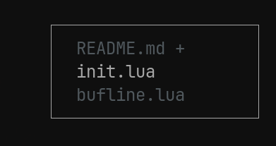

# bufline.nvim

A minimal buffer list that appears in the top-right corner when cycling between buffers, opening new ones and disappears after a delay so it's never in the way.



## install

```lua
{
  "kadam-x/bufline.nvim",
  -- options
  -- config = function()
  --   require("bufline").config.path_depth = 1       -- default: 1, use nil to show full path
  --   require("bufline").config.border = "single"    -- default: "none" , options: "single", "double", "round"
  --   require("bufline").config.next_key = "<tab>"   -- default: "<tab>" , cycles tabs forward
  --   require("bufline").config.prev_key = "<s-tab>" -- default: "<s-tab>", cycles tabs backwards
  --   require("bufline").config.timeout = 2000       -- default: 2000ms, use nil to disable (always visible)
  -- end,
}
```

It uses your colorscheme, active buffers use normal highlight and inactive ones use comment hightlight
